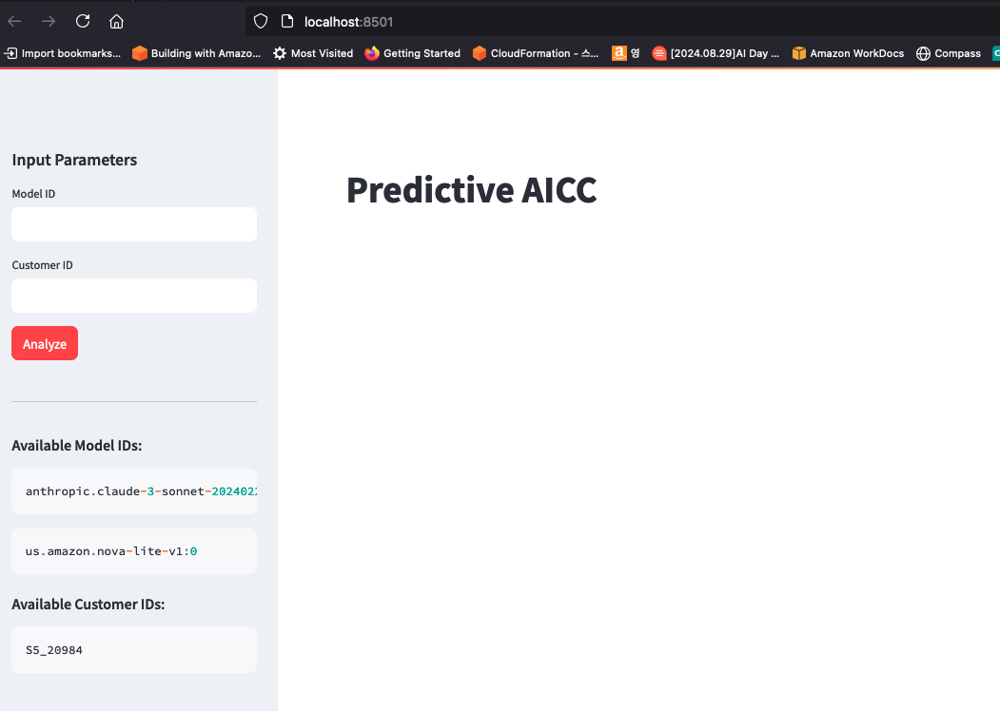
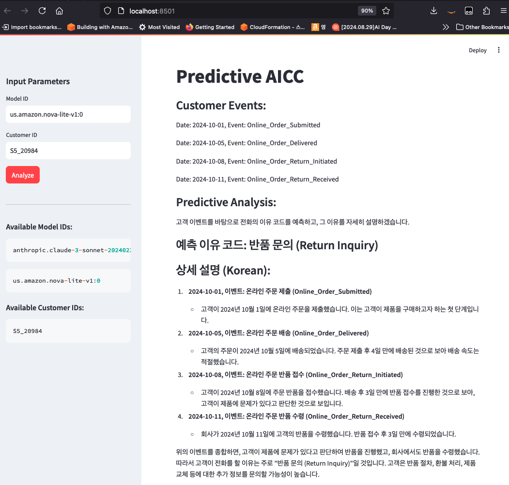

# aws-ai-samples

## 개요

AWS AI Samples은 AWS의 생성형 AI 서비스를 포함한 다양한 서비스를 활용한 생성형 AI 사용 사례를 제공합니다. 

## 제공되는 유스케이스 

### 1. AICC : Predictive Analysis (예측 분석)
- 콜센터 상담원이 상담을 시작하기 전에 고객이 어떤 이유로 전화를 걸었는지를 예측합니다. 
- 아키텍처 : DynamoDB (기존 상담 이력) + Amazon Bedrock (이력 기반으로 전화 이유를 예측하고 이유를 설명)
- 디렉토리 구조
```
pred_aicc/
├── cr_demo_dynamodb.py  # 상담 이력 저장을 위한 DynamoDB 생성 및 샘플데이터 입력
├── app_lib.py           # 샘플 라이브러리 코드
├── app.py/              # 샘플 애플리케이션 코드
```


## 시작하기

1. 선호하는 IDE 환경에서 관련 소스를 다운 받습니다. 
   - 실습 자료 다운로드:
   ```bash
   git clone https://github.com/chloe-kwak/aws-ai-samples.git
   ```

2. 필요한 패키지 설치:
```bash
cd aws-ai-samples
pip install -r requirements.txt -U
```

3. 아래 순서대로 수행:
```bash
python cr_demo_dynamodb.py  #기존 상담 이력 데이터 생성
streamlit run app.py #streamlit 실행
```

4. 인풋 입력하여 데모 진행 (예시)
Model ID : anthropic.claude-3-sonnet-20240229-v1:0
Customer ID : S5_20984



## 참고사항

- 각 유스케이스는 독립적으로 실행 가능합니다.
- 실습을 위해서는 AWS 계정과 적절한 권한이 필요합니다.
